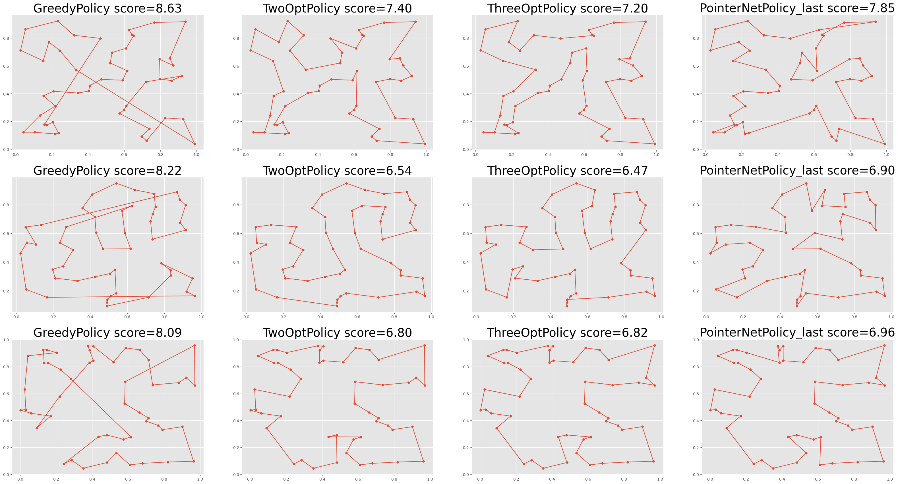

# traveling-salesman-problem

巡回セールスマン問題に対する解法を実装する.

## 利用可能な方策
- RandomPolicy: ランダムに訪問
- SolverPolicy: 厳密解
- GreedyPolicy: 近くの点を逐次的に選択する
- Annealing
    - TwoOptPolicy
    - ThreeOptPolicy
- PointerNetPolicy: 深層強化学習, https://arxiv.org/abs/1611.09940

## 結果
- テストデータ
    - 都市数: 50
    - サンプル数: 1000
    

# Reference
- Bello, I., Pham, H., Le, Q. V., Norouzi, M., & Bengio, S. (2016). Neural combinatorial optimization with reinforcement learning. arXiv preprint arXiv:1611.09940.
